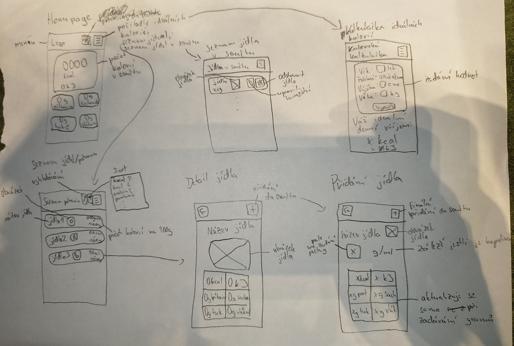

# Výživová kalkulačka

*Autor: Tobiáš Černek tobias.cernek.s@gyarab.cz*

## Odborný článek

Výživová kalkulačka počítá živiny a kalorie na základě vybrané potraviny a její hmotnosti, v případě tekutin objemu.
Kalkulačka také umí vypočítat ideální denní příjem kalorií uživatele na základě udájů jako hmotnost, věk, pohlaví atd., které uživatel zadá.
Potraviny je možné vyhledávat podle jeména, nebo seřadit od nejmenšího k největšímu a naopak podle množství živin na 100g.
Každá potravina má obrázek a počty bílkovin, sacharidů, tuků, vlákniny a kalorií na 100g.
Při přidání potraviny do celkového součtu se automaticky přepočítají hodnoty na 100g na hodnoty pro vybranou hmotnost/objem.

## Wireframes

